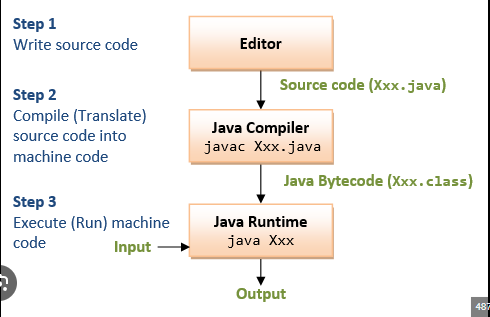

## *compilação java*

PASSO 1:
O programador escreve o código em um editor e o salva com a extensão .java

esse arquivo contém o código legível para humanos e pode ser modificado sempre que necessário

PASSO 2: Compilar o código (.class)
Para transformar o código-fonte em algo que a máquina possa entender, usamos o compilador Java (javac).

O compilador converte HelloWorld.java em bytecode, gerando um novo arquivo: HelloWorld.class.

O arquivo .class contém o código em um formato intermediário (bytecode), que não pode ser lido diretamente por humanos.

1- Escrevemos e editamos o código no .java (arquivo que podemos modificar).

2- Compilamos o código .java, que gera um .class (arquivo executável pela JVM).

3- Executamos o .class na JVM, que interpreta o bytecode e roda o programa.

O arquivo .java é usado para escrever e modificar o código, enquanto o arquivo .class é usado apenas para execução.

